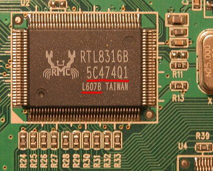

RTL8316B is 16-port 100Mbit switch controller.

Note, that under same marking "RTL8316B" two different chips exists! See details
[here](#how-to-distinguish-old-and-new-flavors-of-rtl8316b-chip).

802.1Q taging VLAN implementation on RTL8316B works fine unlike [RTL8326].

Here is manufacturer's product description:

[http://www.realtek.com.tw/products/productsView.aspx?Langid=1&PNid=20&PFid=22&Level=5&Conn=4&ProdID=33](http://www.realtek.com.tw/products/productsView.aspx?Langid=1&PNid=20&PFid=22&Level=5&Conn=4&ProdID=33)

## Flavors of RTL8316 chip

There are 4 different flavors of RTL8316 chip. See table below for more info:

|  Chip name     | Manageable  | REP | RRCP | [uC-free?][eeprom_uc_helper]  |  Datasheet  |
| -------------- | ----------- | --- | ---- | ----------------------------- | ----------- |
| [RTL8316]      |  No         | No  | No   |     | [RTL8316_Datasheet_1.72.pdf](../assets/datasheets/RTL8316_Datasheet_1.72.pdf)   |
| RTL8316B (Old) |  Yes        | Yes | Yes  | No  | [RTL8316B_Datasheet_1.0.pdf](../assets/datasheets/RTL8316B_Datasheet_1.0.pdf)   |
| RTL8316B (New) |  Yes        | Yes | No   | No  | [RTL8316B_Datasheet_1.2.pdf](../assets/datasheets/RTL8316B_Datasheet_1.2.pdf)   |
| [RTL8316BP]    |  Yes        | Yes | Yes  | Yes | [RTL8316BP_Datasheet_1.2.pdf](../assets/datasheets/RTL8316BP_Datasheet_1.2.pdf) |

## How to distinguish "old" and "new" flavors of RTL8316B chip

There are two flavors of RTL8316B chip: "old" one, which implements RRCP protocol, per-port tx/rx counters, vlans and
many more features. "New" one has RRCP protocol disabled. However, this might not be true anymore, as some recent chips
seem to have RRCP implemented again (as of 10/2008).

At the moment, there is no reliable method of differentiations "old" RTL8316B chips, with working RRCP, and "new",
cutted-down version. The only difference beetween versions is fabric-code:

Here is the list of know-working and know-non-working fab codes:

#### Working, "old" chips:

* 5C474Q1, L607B
* 62052Q1, L609B
* 64318S1, L618B
* 65461Q1, L622B
* 69431S1, L651B
* 6A001Q1, L643B
* 66258Q1, L624B
* 64317S1, L618B
* 83A89Q1, L817B

#### Not working, "new" chips:

* 69512Q1, L640B
* 69542S1, L643B
* 6C173Q1, L706B

[RTL8316]: rtl8316.md
[RTL8326]: rtl8326.md
[RTL8316BP]: rtl8316bp.md
[eeprom_uc_helper]: ../eeprom_uc_helper.md
