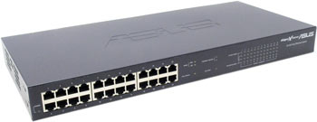
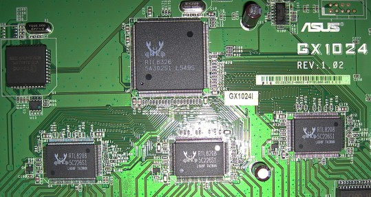

## Description

24-Port 10/100Mbps RRCP-managed Switch

19" Metal case

Internal AC PSU (100-230V)

RRCP is enabled out-of-the-box

Only port-based VLANs are supported

## Chipset

**Switch Controller:** [RTL8326]

**PHY:** 3x RTL8208

**EEPROM:** [DIP8][DIP8] [24C04]

**Microcontroller:** Winbond W78L516A24PL

**Power:** N/A

## Photos

[RTL8326]: ../chip/rtl8326.md
[DIP8]: ../dip8.md
[24c04]: ../eeprom.md#24c04
