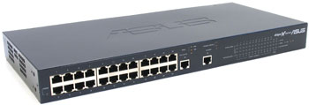
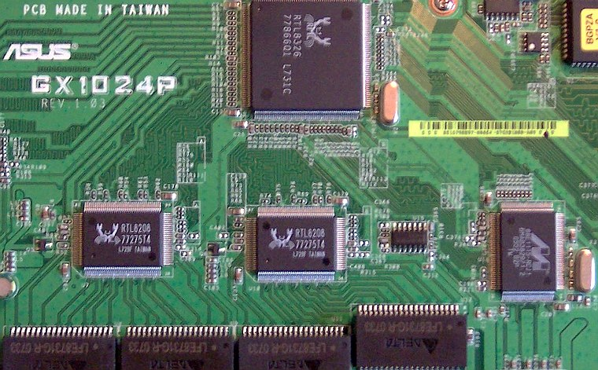

## Description

24-Port 10/100Mbps + 2-Port 10/100/1000Mbps RRCP-managed Switch

19" Metal case

Internal AC PSU (100-230V)

RRCP is enabled out-of-the-box

Only port-based VLANs are supported

## Chipset

**Switch Controller:** [RTL8326]

**PHY:** 3x Realtek RTL8208 + 2x Marvell 88E1115

**EEPROM:** [SOIC8][SOIC8] [24C04]

**Microcontroller:** Winbond W78L516A24PL (Yellow label on top says "BGPZA V1.0 2EC0 M1 03")

**Power:** N/A

## Photos

[RTL8326]: ../chip/rtl8326.md
[SOIC8]: ../soic8.md
[24c04]: ../eeprom.md#24c04
