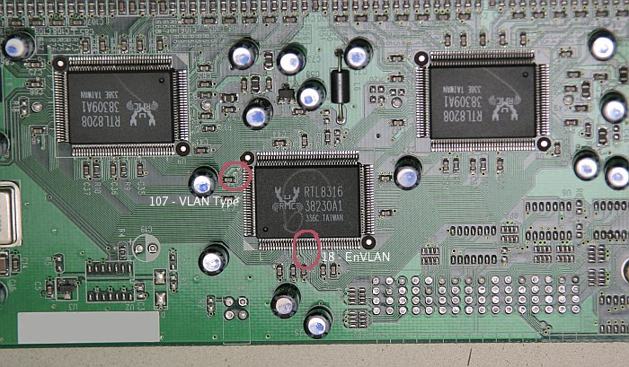
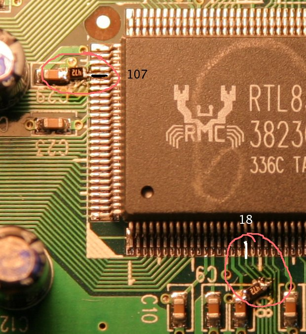

## Description

16-port 10/100 unmanaged switch.

Metal case

Internal AC PSU (100-230V)

RRCP is NOT AVAILABLE and CANNOT BE ENABLED!

## Chipset

**Switch Controller:** [RTL8316]

**PHY:** 2x RTL8208

**Power:** [LDO] ???

## Hardware modifications

[HVLAN] mode can be enabled by soldring 2 resisiors from pins 18 and 107 to GND. See photos for details.

## Photos

## Other version

[D1](dlink_des1016d_d1.md)
[D2](dlink_des1016d_d2.md)
[D4](dlink_des1016d_d4.md)

[RTL8316]: ../chip/rtl8316.md
[LDO]: ../ldo.md
[HVLAN]: ../hvlan.md
