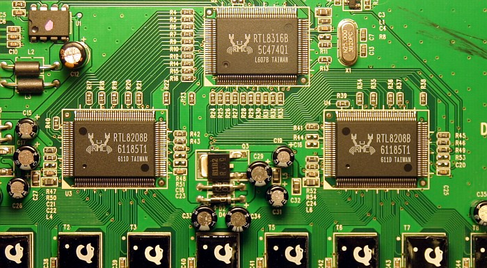
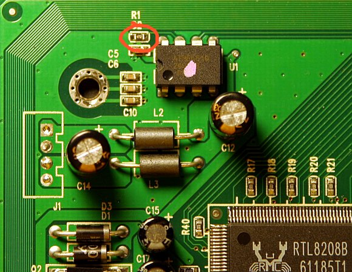
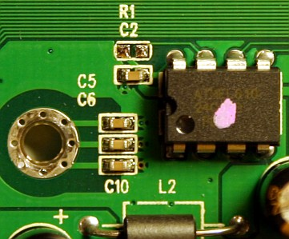

## Description

16-port 10/100 unmanaged switch.

Metal case

Internal AC PSU (100-240V), LEI model SB10-033100-10

Based on RTL8316B.

RRCP is enabled out-of-the-box

EEPROM is write-protected out-of-the-box. See [here][eeprom_write-enabling] how to write-enable it.

MAC address of switch is always `52:54:4c:01:02:03`. You may wish to [change it](#changing-mac-address).

## Chipset

**Switch Controller:** [RTL8316B]

**PHY:** 2x RTL8208B

**EEPROM:** [DIP8][DIP8] [24C02]

**Power:** [LDO] B1182(?)

## Photos



## Hardware modifications

### EEPROM write-enabling

Pin 7 ("WP") of [24C02][24C02] [EEPROM] chip is responsible for write-protecting it. Chip can be written, if this pin is
logic-low (voltage is near GND level). If pin 7 is logic-high (voltage near VCC level), chip is write-protected. D-Link
DES-1016D's 24C02 has this pin in logic-high level due to R1 resistor tieing it to VCC (see first picture):



**=>**



Note, that Pin 7 contains no internal pull-up inside chip, thus, when pin is floating it reads low level. So, to
write-enable EEPROM chip, we need to solder off R1 resistor (see second picture). You may even simply (carefully!)
destroy R1, if can't desolder small parts.

### Changing MAC address

Since all D-Link DES1016D HW rev.D1 switches use same MAC address, it is impossible to efficiently manage network with
more than one such switch. However `rtl83xx` tool version 0.1.93 and higher allows one to change switch MAC address.

Note, that you need to [remove write-protection][eeprom_write-enabling] from EEPROM first!

Syntax is following:

`rtl83xx<_hw_type> <current-mac-address>@<interface> config mac-address <new-mac-address>`

`rtl83xx<_hw_type> <current-mac-address>@<interface> write memory`

For example, to change MAC address of DES1016D on interface eth0 from factory `52:54:4c:01:02:03` to, say,
`00:80:c8:2d:a4:5a`, enter

```shell
./rtl83xx_dlink_des1016d 52:54:4c:01:02:03@eth0 config mac-address 00:80:c8:2d:a4:5a

./rtl83xx_dlink_des1016d 52:54:4c:01:02:03@eth0 write memory
```

### Other version

[C2](dlink_des1016d_c2.md)
[D2](dlink_des1016d_d2.md)
[D4](dlink_des1016d_d4.md)

[eeprom_write-enabling]: ../howto_enable_rrcp.md#method-2-fixing-mac-address-for-rrcp-enabled-switches
[RTL8316B]: ../chip/rtl8316b.md
[DIP8]: ../dip8.md
[24C02]: ../eeprom.md#24c02
[EEPROM]: ../eeprom.md
[LDO]: ../ldo.md
