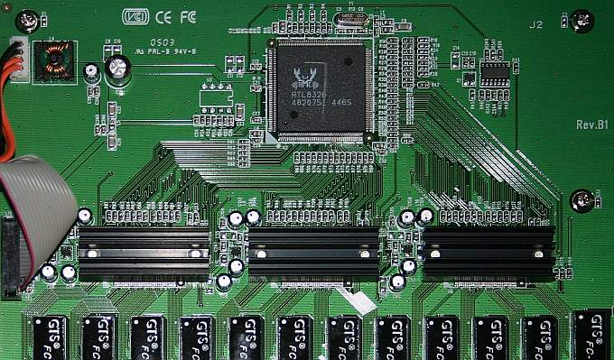
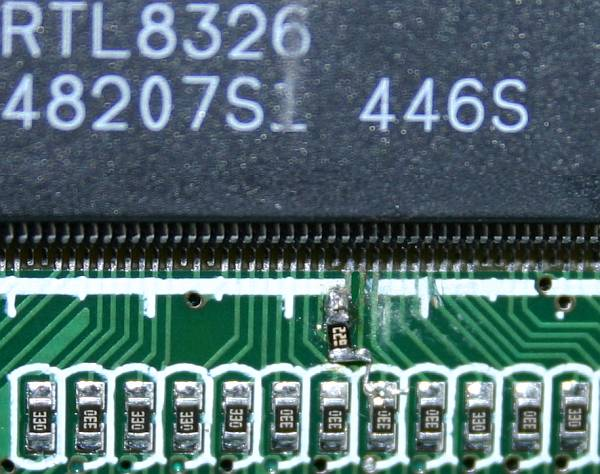

## Description

24-port 10/100 unmanaged switch.

Metal case

Internal AC PSU (100-240V), LEI model SB10-033100-10

Based on RTL8326.

RRCP is disabled out-of-the-box.

EEPROM is absent, but can be soldered in.

Note, that RTL8326 chip implies some restrictions, e.g. there are no 802.1Q VLANs, no port mirroring and no runtime
config saving to EEPROM.

## Chipset

**Switch Controller:** [RTL8326]

**PHY:** 3x RTL8208

**EEPROM:** None, empty [DIP8] place on PCB.

## Photos

## Hardware modifications

### RRCP enabling by pin-strap

RRCP in DES1024D-HW-B1 can be enabled by strapping a 470 Ohm - 4.7 kOhm resistor between pins 34 and 35. See picture:

Read [here][howto_enable_rrcp] for details.

## Other version

[C1](dlink_des1024d_c1.md)

[RTL8326]: ../chip/rtl8326.md
[DIP8]: ../dip8.md
[howto_enable_rrcp]: ../howto_enable_rrcp.md
