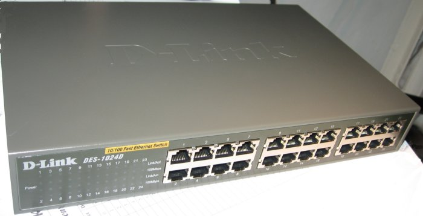
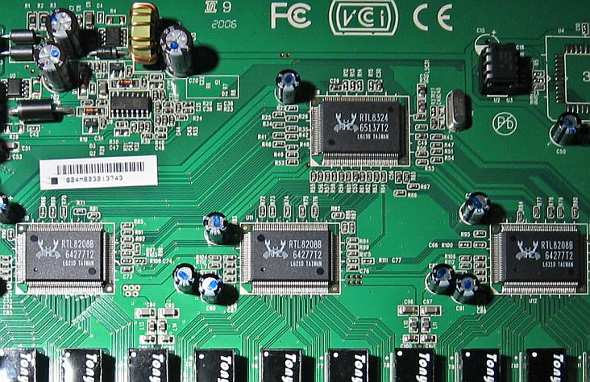

## Description

24-port 10/100 unmanaged switch.

Metal case

Internal AC PSU (100-240V), 5V2A

Based on RTL8324.

RRCP is disabled out-of-the-box. See [here][howto_enable_rrcp] about enabling RRCP.

EEPROM is write-protected out-of-the-box. See [here][howto_enable_rrcp_method_2] how to write-enable it.

## Chipset

**Switch Controller:** [RTL8324]

**PHY:** 3x RTL8208B

**EEPROM:** [DIP8][DIP8] [24C02]

**Power:** [DC/DC][DCDC]

## Photos

## Other version

[B1](dlink_des1024d_b1.md)

[howto_enable_rrcp]: ../howto_enable_rrcp.md
[howto_enable_rrcp_method_2]: ../howto_enable_rrcp.md#method-2-fixing-mac-address-for-rrcp-enabled-switches
[RTL8324]: ../chip/rtl8324.md
[DIP8]: ../dip8.md
[DCDC]: ../dcdc.md
[24C02]: ../eeprom.md#24c02
