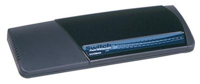
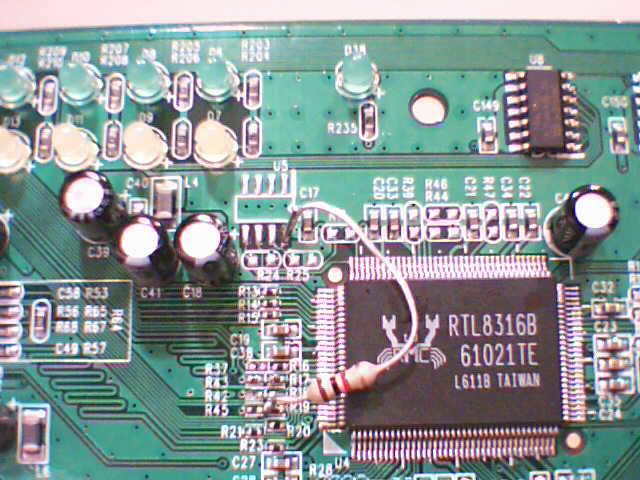

## Description

**NOTE:** This description describes "newer" hardware revision. Some "older" switches with the same name can contain
different chipset.

16-Port 10/100Mbps RRCP-managed Switch

Desktop compact plastic case

External AC PSU

RRCP is disabled out-of-the-box, thru it  [can be enabled](edimax_es3116p_rrcp_enabling.md)

## Chipset

**Switch Controller:** [RTL8316B]

**PHY:** 2x RTL8208

**EEPROM:** empty place for [SOIC8][SOIC8] [24C02] (U5)

**Power:** DC/DC(?)

## Photos

(Note: That big pink resistor was added manualy)

[RTL8316B]: ../chip/rtl8316b.md
[SOIC8]: ../soic8.md
[24C02]: ../eeprom.md#24c02
