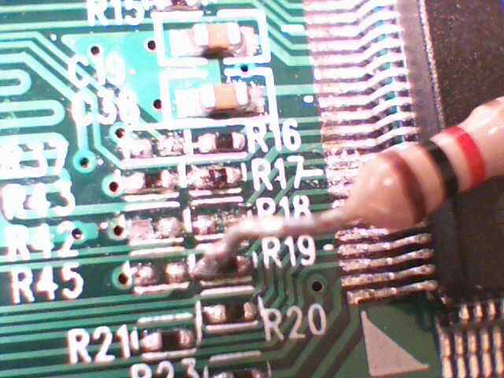
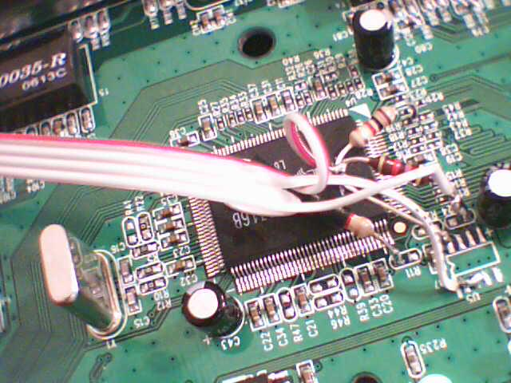
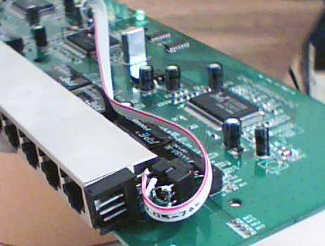

## Making a dump switch into a managed one

**This text was generously contributed by Luigi Rizzo. Original article is available at
[edimax](http://info.iet.unipi.it/~luigi/FreeBSD/edimax/)**

A number of low-cost Ethernet switches on the market are based on the Realtek RTL8316B and RTL8324 controllers (see the
Realtek Web page for data sheets). One that is easily available in my area is the 16-port model made by Edimax, the
Edimax Es3116p.

The newer models of this switch are equipped with a RTL8316B chip. This chip can be controlled or reconfigured in
software through the Ethernet, and perform a number of useful functions, such as setting port features (duplex/speed),
VLAN configuration (tag insertion and removal), port trunking, traffic shaping (not kidding; the 3116 can do bandwidth
control on each port between 128kbit/s and 8Mbit/s), reading statistic counters, even mirroring.

The remote control feature is controlled through either an EEPROM (but this is often not present on the cheapest
models), or through a 'strapping' pin, i.e. the presence of a pullup resistor on one of the pins of the chip. This
feature is also often disabled on many of the cheap models, for a variety of reasons (cost, security).

To enable the 'remote control' feature - all it takes is solder a 1K resistor between pin 121 and Vcc, as in the picture
below.

**PLEASE BE AWARE THAT IF YOU DECIDE TO MODIFY YOUR SWITCH, YOU MUST KNOW WHAT YOU ARE DOING AND TAKE FULL
RESPONSIBILITY FOR IT. SOLDERING IN SUCH A SMALL AREA REQUIRES SOME SKILLS TO AVOID BREAKING TRACES OR COMPONENTS OR
SHORTING PINS TOGETHER.**


In the picture above, you see the RTL8136B with the strapping resistor on pin 121. The chip has 128 pins, numbered
counterclockwise starting from the bottom left corner (near the white triangle). Pin 128 (power supply, incidentally) is
just above the triangle, pin 121 just a little bit above. The pin is actually one of the TxD (for port 5), and it has in
series a 50 Ohm resistor, labeled R19. Next to it there are spare pads for R45, which is exactly the strapping resistor
that I need. Not having a small enough device, i carefully soldered the resistor on one of the pads of R19, and the
other terminal goes to the power pad where you could also connect the serial EEPROM to store configuration information.



Another picture with more details on R19 and R45

## Software

Control of the switch is done through the RRCP protocol, a Realtek protocol based on specially crafted ethernet packets.
Some info on the RRCP protocol is available [here][RRCP]. On this site you will [find][home] an open source an
implementation of the protocol, which compiles under Linux and FreeBSD and allows you to control the switch and perform
a number of functions. Among these, you can access the port counters, do a soft reset of the switch, and configure it to
support vlans (partitioning it in multiple vlans, doing automatic tag insertion/removal, and so on).

The first thing you can do to make sure that the modification worked is to run build the program and run it as

```shell
./rtl8316b rl0 scan
```

to see if your network has one or more RRCP-aware switches. If your modification is successful, you should see one at
least. After that you can use all the options shown by the program to control your switch. Unfortunately, you will not
be able to save your configuration unless you also have (or install) an EEPROM on the switch, that will be used to store
configuration data across hard reboots or power losses. As an example, i connected the eeprom as shown here. Above: a
few pullups and series resistors to connect to the EEPROM, a 24C02). Below, the actual EEPROM and an expansion socket to
connect a microcontroller or other I2C stuff.





## Enhancements

The RTL8316 can connect to an EEPROM or other devices with an I2C interface (the two leftmost pin on the top side of the
controller), and operation on the I2C bus is also controllable through the network - you can write or read from the I2C
bus using ethernet frames. This basically makes it easy to build a variety of simple ethernet-controlled devices, as
long as the data rate is low enough. E.g. you can connect a simple microcontroller with an I2C interface to the I2C bus
and access the registers of the microcontroller (which in turn can be connected to input/output lines, sensors of
various kinds, and so on).

[RRCP]: ../rrcp.md
[home]: ../index.md
