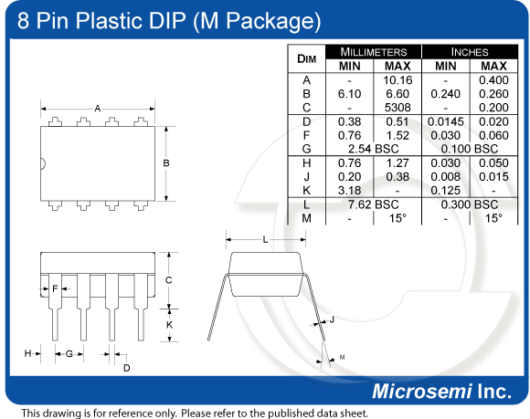
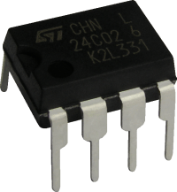
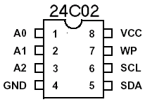

## Description

This is small thru-hole 8-pin package. Used for 24cXX EEPROM's along with [SOIC8](soic8.md)

## Photos

## External links

[http://en.wikipedia.org/wiki/DIP-8](http://en.wikipedia.org/wiki/DIP-8)

[http://en.wikipedia.org/wiki/Dual_in-line_package](http://en.wikipedia.org/wiki/Dual_in-line_package)
