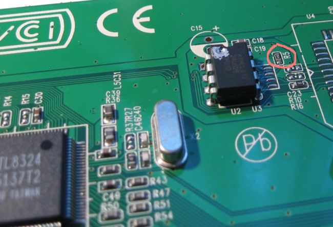

How to enable RRCP support.

## Abstract

This HOW-TO describes method of enabling RRCP protocol on switches, that contains RRCP-capable switch controller (i.e.
[RTL8316B], [RTL8318P], [RTL8324], [RTL8326] or [RTL8326S]), but RRCP protocol does not work out-of-the-box.

### Method 1: EEPROM adding

Some switches comes with an empty place in [PCB], ready for
[EEPROM] chip to be soldered in. This method is preferred for such switches.

1. First, open your switch and take a look at [PCB]. Find a place for EEPROM and figure out it's type - [SOIC8] or
   [DIP8].

1. Get a [24C02] or higher ([24C04], 24C08...) [EEPROM] chip itself in approriate package ([SOIC8] or [DIP8]).

1. Program it with appropriate data using I2C programmer ([PonyProg] or even [bunch-of-wires-lpt-dongle] will do), using ready [EEPROM configuration image][eeprom_configuration_image]

1. Solder it in place.

### Method 2: Fixing MAC-address for RRCP-enabled switches

Some switches (like D-Link DES-1024D and Compex SXP1224B) already have [EEPROM] soldered and RRCP enabled, but contains
original Realtek crap (`52:54:4С:01:02:03`) instead of normal MAC-adrress, so using such devices in production is
impossible (you can have no more than one device in L2-segment). The original solution was to desolder [EEPROM] chip,
program it with appropriate data and solder it back (like in method 1). But there is much simpler solution: **EEPROM
write-enabling**

Pin 7 ("WP") of [24C02][24C02] [EEPROM][EEPROM] chip is responsible for write-protecting it. Chip can be writhen, if this pin is
logic-low (voltage is near GND level). If pin 7 is logic-high (voltage near VCC level), chip is write-protected. I.e.
D-Link DES-1024D's 24C02 has this pin in logic-high level due to R5 resistor tieing it to VCC (see picture):

Note, that Pin 7 contains no internal pull-up inside chip, thus, when pin is floating it reads low level. So, to
write-enable EEPROM chip, we need to solder off R5 resistor. You may even simply (carefully!) destroy R5, if can't
desolder small parts.

### Method 3: Pin strapping

This method is for switches, containing no place for [EEPROM] chip. RTL83xx chips supports one more method of
configuring (pin-strapping). To use this method, you need to solder in resistor (470 Ohm to 10kOhm) between appropriate
pin(s) and ground (power) plane (details is chip-dependent).

Note, that this method implies a 2 serious limitations:

1) Switch will have no MAC address (it will have `00:00:00:00:00:00` as MAC address to be exact) - and as you guess, you
   can't have more than one such switch in a network. Moreover, some "smart" switches (at least, 3COM's 3c1100/3c3300)
   tend to filter out ethernet frames with `00:00:00:00:00:00` as destination MAC address, and you will never reach your
   RRCP-enabled-by-pinstrap switch if such "smart" switch is in the middle.

2) No configuration is saved permanently - you need to constantly (maybe one time per minute - from crontab) reconfigure
   such switch in order to survive switch reboot seamlessly.

#### RTL8316B

Pin 121(*EnRRCP*) is used in RTL8316B to preconfigure RRCP protocol enabled. You need to pull-up this pin to enable RRCP
(i.e. solder in resistor between pin 121 and power-plane - VCC). Nearest pins, connected to VCC are 114 and 128. Note,
that Pin 121 is also used as output for port 5, so do not try to connect it to VCC directly - you will burn port 5.

#### RTL8326/RTL8326S

Pin 35(*DisRRCP*) is used in RTL8326/RTL8326S to preconfigure RRCP protocol enabled. You need to pull-down this pin to
enable RRCP (i.e. solder in resisior between pin 35 and ground-plane - GND). Nearest pin, connected to GND is 34.
Note, that Pin 35 is also used as output for port 10, so do not try to connect it to GND directly - you will burn port
10.

[RTL8316B]: chip/rtl8316b.md
[RTL8318P]: chip/rtl8318p.md
[RTL8324]: chip/rtl8324.md
[RTL8326]: chip/rtl8326.md
[RTL8326S]: chip/rtl8326s.md
[EEPROM]: eeprom.md
[SOIC8]: soic8.md
[DIP8]: dip8.md
[24C02]: eeprom.md#24c02
[24C04]: eeprom.md#24c04
[eeprom_configuration_image]: eeprom_configuration_image.md
[PCB]: https://en.wikipedia.org/wiki/Printed_circuit_board
[PonyProg]: http://www.lancos.com/prog.html
[bunch-of-wires-lpt-dongle]: http://mcmcc.bat.ru/serp/
