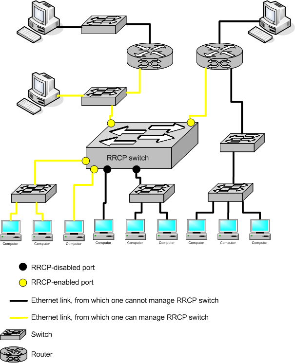

RRCP security model

## Abstract

[RRCP] is a protocol for managing switches. Since such switch may be exposed to customers, peer partners or otherwise
not-trusted environnement, security must be considered in regard of controlling who can manage the switch, and who - not.

## Description

OpenRRCP can enable or disable RRCP protocol on per-port basis.

RRCP is L2 protocol and, thus cannot propagate through L3 environment such as router or L3 switches. VLAN's are also
efficient to isolate RRCP-enabled managing links from untrusted customer-data links.

Additionally, AuthKey parameter can be used for further security escalation. However, unfortunately, this parameter is
only 16-bit long and thus, all of it 65536 possible values can be brute-forced in several minutes.

To make AuthKey protection strong enough, administrator need to change switch MAC address and disable REP protocol. In
this mode 48-bit(MAC)+16-bit(AuthKey) = 64 Bit brute-force attack will be required to compromise switch. Since 2^64
iterations of minimum 1 millisecond each requires more than 500 millions years to complete, this protection is
considered reasonable.

## Model

[RRCP]: rrcp.md
