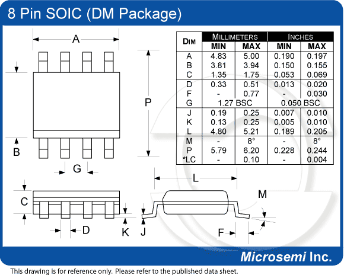
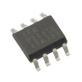

## Description

This is small thru-hole 8-pin package. Used for 24cXX EEPROM's along with [DIP8](dip8.md)

## Photos

## External links

[http://en.wikipedia.org/wiki/Small-Outline_Integrated_Circuit](http://en.wikipedia.org/wiki/Small-Outline_Integrated_Circuit)
